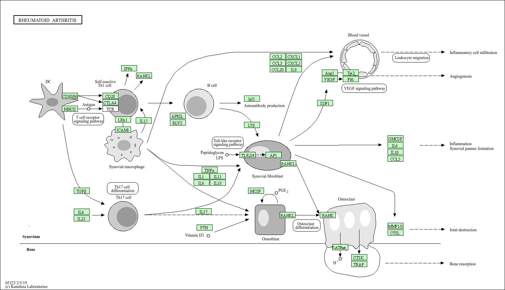

<<<<<<< HEAD
\# RNA‑seq analyse van Rheumatoïde Artritis (RA)
=======
# Transcriptomics Analyse van Rheumatoïde Artritis (RA): Van Raw Reads tot Pathway Inzicht\

Dit project onderzoekt verschillen in genexpressie tussen vier reumapatiënten en vier gezonde controles met behulp van RNA‑sequencing. De volledige workflow van raw FASTQ tot functionele interpretatie is uitgevoerd in R en gedocumenteerd in deze repository.
>>>>>>> d3c19c286a9b5efc9a02de6755f6bc3ad14b2292

\*\*Van raw reads tot pathway‑inzicht (RA vs gezonde controles)\*\*

\## Inleiding

Rheumatoïde artritis (RA) is een chronische auto‑immuunziekte waarbij het immuunsysteem het synoviale weefsel aanvalt. Dit leidt tot persisterende gewrichtsontsteking, kraakbeen- en botschade en uiteindelijk functieverlies. RA heeft een aanzienlijke impact op kwaliteit van leven en arbeidsvermogen, en komt voor bij ongeveer 0,5–1% van de bevolking wereldwijd.

<<<<<<< HEAD

Met transcriptomics (RNA‑seq) kunnen genexpressieprofielen van RA‑patiënten vergeleken worden met gezonde individuen. Dit maakt het mogelijk om de onderliggende moleculaire processen en pathways in kaart te brengen en potentiële therapeutische aangrijpingspunten te identificeren.

In dit project zijn RNA‑seq data van vier RA‑patiënten en vier gezonde controles geanalyseerd. De volledige workflow — van mapping tot pathway‑analyse — is reproduceerbaar uitgevoerd en gedocumenteerd in deze GitHub‑repository.

=======
# Volcano plot – differentiële genexpressie  

# Uitleg:  
Deze volcano plot toont de log2‑fold change (x‑as) tegenover de −log10(p‑waarde) (y‑as).
Genen rechts zijn opgereguleerd in RA, genen links zijn neer‑gereguleerd.
Hoe hoger een punt staat, hoe sterker de statistische significantie.
De plot laat duidelijk zien dat meerdere ontstekingsgerelateerde genen sterk opgereguleerd zijn.

# GO‑analyse – Top 10 verrijkte biologische processen

# Uitleg:  
Deze figuur toont de tien meest verrijkte GO‑termen (Biological Process).
De grootte van de bol geeft het aantal betrokken genen weer; de kleur geeft de p‑waarde aan.
Belangrijke processen zoals immune response, leukocyte activation en adaptive immune response zijn sterk verrijkt, wat past bij de pathofysiologie van RA.

# KEGG-pathway - hsa05323 (normaal)
 
 
# KEGG‑pathway – hsa05323 (Rheumatoid arthritis)
   
  

# Uitleg:  
Deze KEGG‑pathway is automatisch ingekleurd met log2‑fold changes uit DESeq2.
Rood = opregulatie, groen = neerregulatie.
De pathway laat activatie zien van o.a. TNF‑signaling, IL‑1/IL‑6‑routes, chemokines, T‑celactivatie, B‑celactivatie en RANKL‑gemedieerde osteoclastvorming.
Dit bevestigt dat RA‑samples sterke immuunactivatie en weefselremodellering vertonen.

# INLEIDING
Rheumatoïde artritis (RA) is een chronische auto‑immuunziekte waarbij het immuunsysteem het synoviale weefsel aanvalt. Dit leidt tot ontsteking, gewrichtsschade en functieverlies. Transcriptomics maakt het mogelijk om genexpressiepatronen tussen patiënten en gezonde individuen te vergelijken en zo inzicht te krijgen in de moleculaire processen die bijdragen aan RA.
>>>>>>> d3c19c286a9b5efc9a02de6755f6bc3ad14b2292

<<<<<<< HEAD
\---
=======
# METHODE
Voor deze analyse zijn paired‑end RNA‑seq datasets gebruikt. Eerst is een index van het humane referentiegenoom (GRCh38) gebouwd met Rsubread, waarna alle FASTQ‑reads zijn gemapt. De BAM‑bestanden zijn gesorteerd en geïndexeerd met Rsamtools.
>>>>>>> d3c19c286a9b5efc9a02de6755f6bc3ad14b2292

\## Onderzoeksvragen

<<<<<<< HEAD
=======
# RESULTATEN
De KEGG‑pathway hsa05323 (Rheumatoid arthritis) toont duidelijke activatie van ontstekingsroutes in RA‑samples. Pro‑inflammatoire cytokines zoals TNF‑α, IL‑1, IL‑6 en IL‑18 zijn sterk opgereguleerd, wat de ontstekingscascade versterkt via NF‑κB‑signaling.
>>>>>>> d3c19c286a9b5efc9a02de6755f6bc3ad14b2292

\### \*\*Hoofdvraag\*\*

\- In welke mate verschillen genexpressieprofielen tussen RA‑patiënten en gezonde controles, en welke biologische processen en pathways zijn hierbij betrokken?

<<<<<<< HEAD
=======
# CONCLUSIE
De RNA‑seq analyse toont duidelijke verschillen in genexpressie tussen RA‑patiënten en gezonde controles. Ontstekingsgerelateerde genen zijn sterk opgereguleerd in RA‑samples. GO‑analyse laat verrijking zien van immuunactivatie, cytokineproductie en leukocytenmigratie. De KEGG‑pathwayanalyse bevestigt activatie van belangrijke ontstekingsroutes, waaronder TNF‑signaling, chemokine‑signaling en osteoclastvorming.
>>>>>>> d3c19c286a9b5efc9a02de6755f6bc3ad14b2292

<<<<<<< HEAD
\### \*\*Deelvragen\*\*
=======
# COMPETENTIE BEHEREN
Zie de bestanden in de map /beheren:
>>>>>>> d3c19c286a9b5efc9a02de6755f6bc3ad14b2292

1\. Welke genen zijn significant differentieel tot expressie tussen RA en gezonde controles?

2\. Welke biologische processen (GO‑termen) zijn verrijkt in RA‑samples?

3\. Welke KEGG‑pathways, met name hsa05323 (Rheumatoid arthritis), laten activatie zien in RA‑samples?

\_Relevante literatuur en bronnen worden genoemd in `/docs/Inleiding.md`.\_

\---

\## Data en methode

\### Data

\- \*\*Samples:\*\* 4 RA‑patiënten, 4 gezonde controles  

\- \*\*Sequencing:\*\* Paired‑end RNA‑seq  

\- \*\*Referentiegenoom:\*\* Homo sapiens, GRCh38 (GCF\_000001405.40)  

\- \*\*Annotatie:\*\* GTF‑bestand passend bij GRCh38  

\- \*\*Herkomst data:\*\* Publieke RNA‑seq dataset (SRA/GEO; accessionnummers in `/docs/Methode.md`)  

\### Bioinformatica workflow

De analyse is uitgevoerd in R met de volgende hoofdonderdelen:

\- \*\*Mapping\*\*

&#x20; - Package: `Rsubread`

&#x20; - Index gebouwd op GRCh38 (`buildindex`)

&#x20; - Paired‑end reads gemapt naar het referentiegenoom (`align`)

\- \*\*BAM‑verwerking\*\*

&#x20; - Package: `Rsamtools`

&#x20; - Sorteren en indexeren van BAM‑bestanden (`sortBam`, `indexBam`)

\- \*\*Tellingenmatrix\*\*

&#x20; - Package: `Rsubread::featureCounts`

&#x20; - Annotatie: GTF‑bestand (GRCh38)

&#x20; - Output: gen‑tellingen per sample → `count\_matrix`

\- \*\*Differentiële expressie\*\*

&#x20; - Package: `DESeq2`

&#x20; - Design: `RA` vs `Normal`

&#x20; - Output: log2 fold change, p‑waarden, FDR‑gecorrigeerde p‑waarden

\- \*\*GO‑analyse\*\*

&#x20; - Packages: `goseq`, `geneLenDataBase`, `GO.db`, `org.Hs.eg.db`

&#x20; - SYMBOL → ENSEMBL mapping (`mapIds`)

&#x20; - Correctie voor genlengtebias (`nullp`)

&#x20; - Verrijkte GO‑termen bepaald met `goseq`

\- \*\*KEGG‑pathwayanalyse\*\*

&#x20; - Package: `pathview`

&#x20; - Pathway: \*\*hsa05323 (Rheumatoid arthritis)\*\*

&#x20; - Input: log2 fold changes uit DESeq2

&#x20; - Output: ingekleurde KEGG‑pathwayfiguren

De volledige code is te vinden in `/scripts/transcriptomics\_RA.R`.  

Inputbestanden staan in `/data`, resultaten in `/results` en figuren in `/figures`.

\---

\## Repository structuur

\- `/data` → FASTQ, BAM, GTF en referentiegenoom  

\- `/scripts` → volledig R‑script (mapping → DE → GO → KEGG)  

\- `/results` → DESeq2‑tabellen, GO‑resultaten, KEGG‑tabellen  

\- `/figures` → volcano plot, GO‑plot, KEGG‑pathwayfiguren  

\- `/docs` → Inleiding, Methode, Resultaten, Conclusie  

\- `/beheren` → Data Stewardship \& GitHub‑beheer (competentie Beheren)  

\---

\## Resultaten

\### Volcano plot – differentiële genexpressie

!\[Volcano plot](figures/volcano\_plot.png)

Deze volcano plot toont de log2‑fold change (x‑as) tegenover de −log10(p‑waarde) (y‑as). Genen rechts zijn opgereguleerd in RA, genen links zijn neer‑gereguleerd. De plot laat duidelijk zien dat meerdere ontstekingsgerelateerde genen sterk opgereguleerd zijn in RA‑samples.

\---

\### GO‑analyse – Top 10 verrijkte biologische processen

!\[GO top 10](figures/GO\_top10.png)

Deze figuur toont de tien meest verrijkte GO‑termen (Biological Process). Belangrijke processen zoals immune response, leukocyte activation en adaptive immune response zijn sterk verrijkt, wat past bij de pathofysiologie van RA.

\---

\### KEGG‑pathway – hsa05323 (Rheumatoid arthritis)

!\[KEGG RA pathway](figures/KEGG\_hsa05323.png)

De KEGG‑pathway hsa05323 is automatisch ingekleurd met log2‑fold changes uit DESeq2. Rood = opregulatie, groen = neerregulatie. De pathway laat activatie zien van o.a. TNF‑signaling, IL‑1/IL‑6‑routes, chemokines, T‑celactivatie, B‑celactivatie en RANKL‑gemedieerde osteoclastvorming.

\---

\## Conclusie

\*\*Hoofdvraag\*\*  

De RNA‑seq analyse toont duidelijke verschillen in genexpressie tussen RA‑patiënten en gezonde controles. Ontstekingsgerelateerde genen zijn sterk opgereguleerd in RA‑samples.

\*\*Deelvragen\*\*

1\. \*\*Differentiële genexpressie:\*\* meerdere genen betrokken bij ontsteking, cytokineproductie en immuuncelactivatie zijn significant differentieel tot expressie tussen RA en controles.  

2\. \*\*Biologische processen:\*\* GO‑analyse laat verrijking zien van immuunactivatie, cytokineproductie en leukocytenmigratie.  

3\. \*\*Pathways:\*\* KEGG‑analyse bevestigt activatie van belangrijke ontstekingsroutes, waaronder TNF‑signaling, chemokine‑signaling en osteoclastvorming.  

Deze geïntegreerde analyse geeft een consistent biologisch beeld dat overeenkomt met de klinische kenmerken van RA.

\---

\## Competentie Beheren (GitHub \& data stewardship)

Zie de bestanden in `/beheren`:

\- `DataStewardship.md` – structuur, opslag, versiebeheer, reproduceerbaarheid  

\- `GitHubBeheren.md` – commits, branches, mapstructuur, documentatie  

Deze repository is zo ingericht dat een andere gebruiker de analyse kan klonen, de R‑scripts kan uitvoeren en de resultaten kan reproduceren.

\---

\_Sander – J2P4 Transcriptomics, NHL Stenden Hogeschool\_

