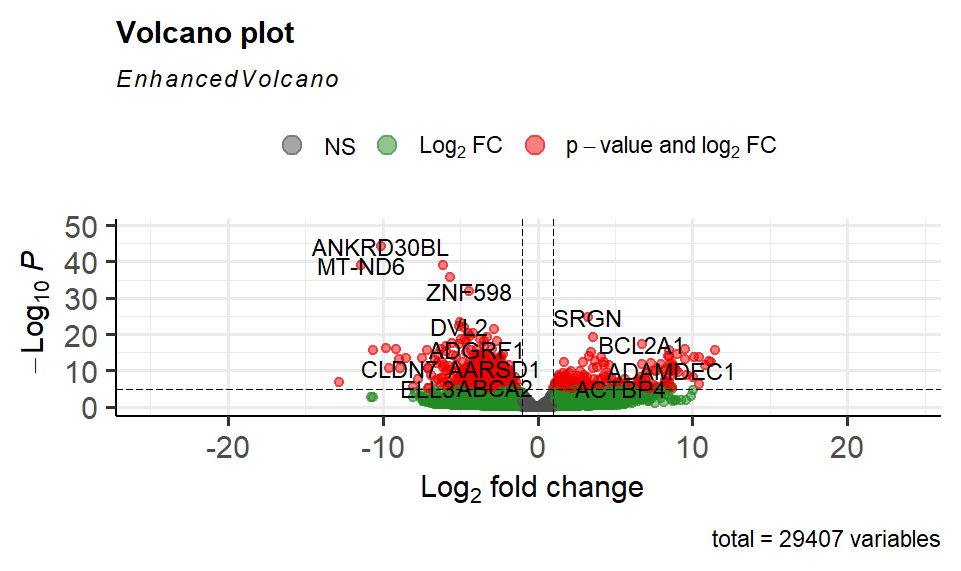
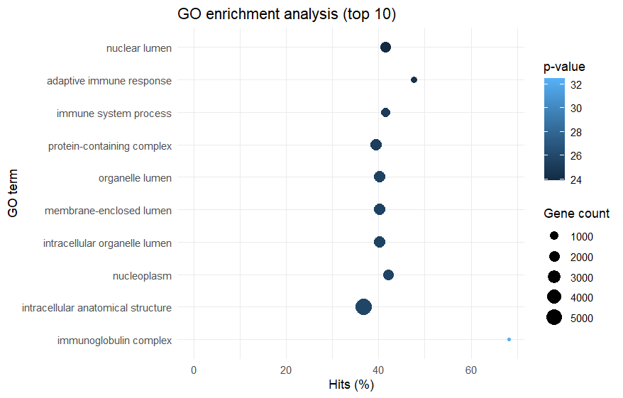

# Transcriptomics Analyse van Rheumatoïde Artritis versus Gezonde Controles: De Rol van MMP1/3, CTSL en V-ATPase binnen de hsa05323-pathway.

# Inleiding

Rheumatoïde artritis (RA) is een chronische auto-immuunziekte die wordt gekenmerkt door persisterende ontsteking van het synoviale weefsel, wat onbehandeld leidt tot onomkeerbare kraakbeen en botschade.
Hoewel de precieze oorzaak onbekend is, laten grootschalige transcriptomics-studies zien dat specifieke genexpressieprofielen en co-expressiepatronen in het synovium essentieel zijn voor het begrijpen van de pathofysiologie (Platzer et al., 2019).
Binnen dit proces speelt de KEGG-pathway hsa05323 (Rheumatoid Arthritis) een sleutelrol; hierin is te zien hoe cytokines de productie van destructieve moleculen aansturen.
Dit onderzoek richt zich specifiek op de moleculaire "uitvoerders" van gewrichtsschade binnen deze pathway: de matrix-afbrekende enzymen MMP1, MMP3 en Cathepsine L (CTSL).
Onderzoek heeft aangetoond dat de expressie van CTSL in synoviale fibroblasten sterk wordt gereguleerd door cytokines, wat direct bijdraagt aan de afbraak van de gewrichtsmatrix (Hummel et al., 2003).
Daarnaast wordt gekeken naar het V-ATPase complex, een protonpomp die cruciaal is voor de verzuring van de extracellulaire ruimte door osteoclasten, wat noodzakelijk is voor botresorptie.
Het doel van dit project is om middels een reproduceerbare RNA-seq workflow de genexpressie van vier RA-patiënten te vergelijken met vier gezonde controles
Door specifiek in te zoomen op deze enzymen binnen de hsa05323-pathway, wordt getracht de mechanismen achter de gewrichtsdestructie bij RA verder te ontrafelen.

---

**Gebruikte wetenschappelijke bronnen:**
*   [1. Platzer et al. (2019) - Analyse van genexpressie en co-expressiepatronen in RA](https://pubmed.ncbi.nlm.nih.gov/31344123/)
*   [2. Hummel et al. (2003) - Regulatie van Cathepsine L (CTSL) in RA-f](https://pubmed.ncbi.nlm.nih.gov/12509618/)

---

## Onderzoeksvragen

### **Hoofdvraag**
Welke rol spelen matrix-afbrekende enzymen (MMP1/3, CTSL) en het V-ATPase complex binnen de hsa05323-pathway bij de gewrichtsschade in patiënten met reumatoïde artritis?

### **Deelvragen**
1. Differentiële Expressie: Welke genen in de totale dataset vertonen de meest significante verschillen in expressie tussen RA-patiënten en gezonde controles?
2. Pathway Activatie: In welke mate is de KEGG-pathway hsa05323 geactiveerd in de RA-samples en welke sub-processen (zoals osteoclast-activiteit of kraakbeenafbraak) vallen hierbij op?
3. Specifieke Focus: Is er een statistisch significante opregulatie van de genen MMP1, MMP3, CTSL en de sub-units van het V-ATPase complex (ATP6V-genen) in de synoviale biopten van RA-patiënten?

---

## Data en methode

### Data
- **Samples:** 4 RA‑patiënten, 4 gezonde controles (verkregen uit synoviumbiopten, weefsel uit het gewrichtsslijmvlies) 
- **Sequencing:** Paired‑end RNA‑seq  
- **Referentiegenoom:** Homo sapiens, GRCh38 (GCF_000001405.40)  
- **Annotatie:** GTF‑bestand passend bij GRCh38  
- **Herkomst data:** Publieke RNA‑seq dataset (SRA/GEO; accessionnummers in `/docs/Methode.md`)  

### Bioinformatica workflow

De analyse is uitgevoerd in R met de volgende hoofdonderdelen:

**Software en versies:**  
R 4.3.x  
Rsubread 2.x  
DESeq2 1.x  
goseq 1.x  
pathview 1.x  

**Referentiegenoom:**  
GRCh38 (GCF_000001405.40)  
https://www.ncbi.nlm.nih.gov/datasets/genome/GCF_000001405.40/

- **Mapping**
  - Package: `Rsubread`
  - Index gebouwd op GRCh38 (`buildindex`)
  - Paired‑end reads gemapt naar het referentiegenoom (`align`)

- **BAM‑verwerking**
  - Package: `Rsamtools`
  - Sorteren en indexeren van BAM‑bestanden (`sortBam`, `indexBam`)

- **Tellingenmatrix**
  - Package: `Rsubread::featureCounts`
  - Annotatie: GTF‑bestand (GRCh38)
  - Output: gen‑tellingen per sample → `count_matrix`

- **Differentiële expressie**
  - Package: `DESeq2`
  - Design: `RA` vs `Normal`
  - Output: log2 fold change, p‑waarden, FDR‑gecorrigeerde p‑waarden

- **GO‑analyse**
  - Packages: `goseq`, `geneLenDataBase`, `GO.db`, `org.Hs.eg.db`
  - SYMBOL → ENSEMBL mapping (`mapIds`)
  - Correctie voor genlengtebias (`nullp`)
  - Verrijkte GO‑termen bepaald met `goseq`

- **KEGG‑pathwayanalyse**
  - Package: `pathview`
  - Pathway: **hsa05323 (Rheumatoid arthritis)**
  - Input: log2 fold changes uit DESeq2
  - Output: ingekleurde KEGG‑pathwayfiguren
 

De volledige code is te vinden in `/scripts/transcriptomics_RA.R`.  
Inputbestanden staan in `/data`, resultaten in `/results` en figuren in `/figures`.

---

## Repository structuur

- `/data` → FASTQ, BAM, GTF en referentiegenoom  
- `/scripts` → volledig R‑script (mapping → DE → GO → KEGG)  
- `/results` → DESeq2‑tabellen, GO‑resultaten, KEGG‑tabellen  
- `/figures` → volcano plot, GO‑plot, KEGG‑pathwayfiguren  
- `/docs` → Inleiding, Methode, Resultaten, Conclusie  
- `/beheren` → Data Stewardship & GitHub‑beheer (competentie Beheren)  

---

## Resultaten

### Volcano plot – differentiële genexpressie

Deze volcano plot toont de log2‑fold change (x‑as) tegenover de −log10(p‑waarde) (y‑as). Genen rechts zijn opgereguleerd in RA, genen links zijn neer‑gereguleerd. De plot laat duidelijk zien dat meerdere ontstekingsgerelateerde genen sterk opgereguleerd zijn in RA‑samples.

---

### GO‑analyse – Top 10 verrijkte biologische processen

Deze figuur toont de tien meest verrijkte GO‑termen (Biological Process). Belangrijke processen zoals immune response, leukocyte activation en adaptive immune response zijn sterk verrijkt, wat past bij de pathofysiologie van RA.

---

### KEGG‑pathway – hsa05323 (Rheumatoid arthritis)

De KEGG‑pathway hsa05323 is automatisch ingekleurd met log2‑fold changes uit DESeq2. Rood = opregulatie, groen = neerregulatie. De pathway laat activatie zien van o.a. TNF‑signaling, IL‑1/IL‑6‑routes, chemokines, T‑celactivatie, B‑celactivatie en RANKL‑gemedieerde osteoclastvorming.

---

## Conclusie

**Hoofdvraag**  
De RNA‑seq analyse toont duidelijke verschillen in genexpressie tussen RA‑patiënten en gezonde controles. Ontstekingsgerelateerde genen zijn sterk opgereguleerd in RA‑samples.

**Deelvragen**

1. **Differentiële genexpressie:** meerdere genen betrokken bij ontsteking, cytokineproductie en immuuncelactivatie zijn significant differentieel tot expressie tussen RA en controles.  
2. **Biologische processen:** GO‑analyse laat verrijking zien van immuunactivatie, cytokineproductie en leukocytenmigratie.  
3. **Pathways:** KEGG‑analyse bevestigt activatie van belangrijke ontstekingsroutes, waaronder TNF‑signaling, chemokine‑signaling en osteoclastvorming.  

Deze geïntegreerde analyse geeft een consistent biologisch beeld dat overeenkomt met de klinische kenmerken van RA.

---

## Competentie Beheren (GitHub & data stewardship)

Zie de bestanden in `/beheren`:

- `DataStewardship.md` – structuur, opslag, versiebeheer, reproduceerbaarheid  
- `GitHubBeheren.md` – commits, branches, mapstructuur, documentatie  

Deze repository is zo ingericht dat een andere gebruiker de analyse kan klonen, de R‑scripts kan uitvoeren en de resultaten kan reproduceren.

---

_Sander – J2P4 Transcriptomics, NHL Stenden Hogeschool_
