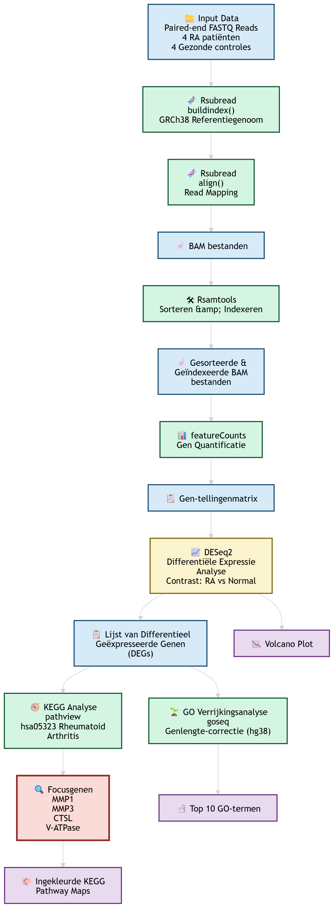
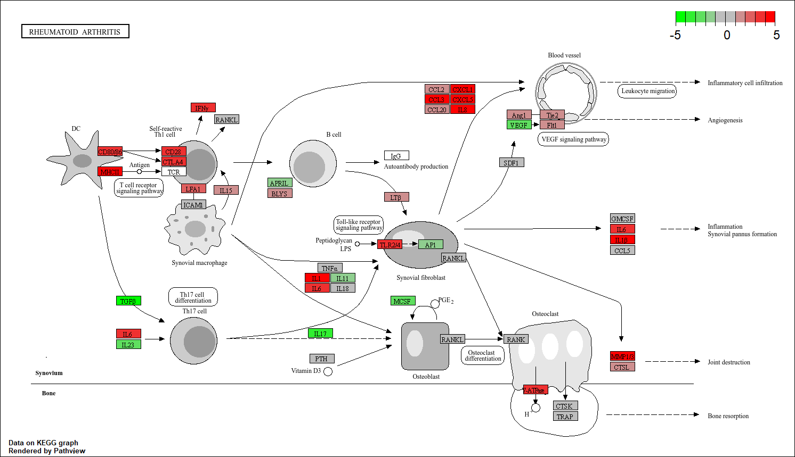

# Transcriptomics Analyse van Rheumatoïde Artritis versus Gezonde Controles: De Rol van MMP1/3, CTSL en V-ATPase binnen de hsa05323-pathway.

# Inleiding

Rheumatoïde artritis (RA) is een chronische auto-immuunziekte die wordt gekenmerkt door voortdurende ontsteking van het synoviale weefsel, wat onbehandeld leidt tot onomkeerbare kraakbeen en botschade.
Hoewel de precieze oorzaak onbekend is, laten grootschalige transcriptomics studies zien dat specifieke genexpressieprofielen en co-expressiepatronen in het synovium essentieel zijn voor het begrijpen van de pathofysiologie (Platzer et al., 2019).
Binnen dit proces speelt de KEGG-pathway hsa05323 (Rheumatoid Arthritis) een sleutelrol; hierin is te zien hoe cytokines de productie van destructieve moleculen aansturen.
Dit onderzoek richt zich specifiek op de moleculaire "uitvoerders" van gewrichtsschade binnen deze pathway: de matrix-afbrekende enzymen MMP1, MMP3 en Cathepsine L (CTSL).
Onderzoek heeft aangetoond dat de expressie van CTSL in synoviale fibroblasten sterk wordt gereguleerd door cytokines, wat direct bijdraagt aan de afbraak van de gewrichtsmatrix (Hummel et al., 2003).
Daarnaast wordt gekeken naar het V-ATPase complex, een protonpomp die cruciaal is voor de verzuring van de extracellulaire ruimte door osteoclasten, wat noodzakelijk is voor botresorptie.
Het doel van dit project is om middels een reproduceerbare RNA-seq workflow de genexpressie van vier RA-patiënten te vergelijken met vier gezonde controles
Door specifiek in te zoomen op deze enzymen binnen de hsa05323‑pathway wordt geprobeerd de mechanismen achter gewrichtsdestructie bij RA verder te ontrafelen.

---

## Onderzoeksvragen

### **Hoofdvraag**
Welke rol spelen matrix-afbrekende enzymen (MMP1/3, CTSL) en het V-ATPase complex binnen de hsa05323-pathway bij de gewrichtsschade in patiënten met reumatoïde artritis?

### **Deelvragen**
1. Differentiële Expressie: Welke genen in de totale dataset vertonen de meest significante verschillen in expressie tussen reuma patiënten en gezonde controles?
2. Pathway Activatie: In welke mate is de KEGG-pathway hsa05323 geactiveerd in de RA-samples en welke sub-processen (zoals osteoclast-activiteit of kraakbeenafbraak) vallen hierbij op?
3. Specifieke Focus: Is er een statistisch significante opregulatie van de genen MMP1, MMP3, CTSL en de sub-units van het V-ATPase complex in de synoviale biopten van RA-patiënten?

---

## Data en methode

### Data
De dataset voor dit onderzoek bestaat uit acht monsters verkregen via synoviumbiopten (weefsel uit het gewrichtsslijmvlies): vier monsters van patiënten met reumatoïde artritis (RA) en vier monsters van gezonde controles.
De analyse is uitgevoerd op publiek beschikbare paired-end RNA-sequencing data.
Deze data is oorspronkelijk gegenereerd met behulp van het Illumina HiSeq-platform om een hoge resolutie van het transcriptoom te verkrijgen (Platzer et al., 2019).
Voor de mapping is gebruikgemaakt van het menselijk referentiegenoom Homo sapiens GRCh38 (versie GCF_000001405.40), met een bijbehorend GTF-bestand voor de nauwkeurige annotatie van genen.

### Bioinformatica workflow

De onderstaande workflow (Figuur 1) visualiseert de stappen van de ruwe data naar functionele biologische resultaten. Deze volledige workflow is uitgevoerd in R (versie 4.5.2).



**Figuur 1.** stroomschema - workflow

De methodiek is als volgt onderverdeeld:
Mapping & Quantificatie: De ruwe reads zijn gemapt met de package Rsubread (v2.24.0).
Na het sorteren en indexeren van de BAM files met Rsamtools zijn de gen tellingen gegenereerd met de functie featureCounts, wat resulteerde in een tellingenmatrix.
Differentiële Expressie Analyse: Met het package DESeq2 (v1.50.2) is de statistische vergelijking uitgevoerd tussen de RA-groep en de gezonde controles. Er is een contrast ingesteld om specifiek de expressieverschillen (log2-fold changes) en gecorrigeerde p-waarden te bepalen.
GO-analyse: Met de package goseq (v1.62.0) is een Gene Ontology analyse uitgevoerd om verrijkte biologische processen te identificeren. Voor deze analyse is gebruikgemaakt van de genlengte informatie van de hg19 build als proxy voor de hg38 mappingdata. Dit is gedaan omdat de specifieke lengte database voor hg38 lokaal niet beschikbaar was. Gezien de minimale verschillen in genlengtes tussen deze versies, heeft dit geen significante invloed op de bias correctie, maar het is vermeld om de volledige reproduceerbaarheid te waarborgen.
KEGG Pathway Analyse: Met de package pathview (v1.50.0) is specifiek ingezoomd op de pathway hsa05323 (Rheumatoid Arthritis). Hierbij lag de focus op de regulatie van matrix afbrekende enzymen (MMP1, MMP3, CTSL) en de betrokkenheid van het V-ATPase complex bij botafbraak.

---

## Repository structuur

Deze repository is ingericht volgens de principes van reproduceerbare bio-informatica.  
Elke map heeft een duidelijke functie binnen de workflow:

- **/beheren** – Data stewardship en GitHub‑beheer (competentie Beheren).
- **/data** – ruwe FASTQ, BAM, index en referentiegenoom (niet gecommit i.v.m. grootte).
- **/docs** – Inleiding, Methode, Resultaten, Conclusie en packages.
- **/figures** – volcano plot, GO‑plot en KEGG‑visualisaties.      
- **/results** – tabellen met DE‑genen, GO‑resultaten en KEGG‑uitvoer.  
- **/scripts** – volledig R‑script voor mapping → DESeq2 → GO → KEGG.

---

## Reproduceerbaarheid

Deze analyse is volledig reproduceerbaar door:

1. De repository te clonen  
   ```bash
   git clone https://github.com/sander-SV/Transcriptomics-Project-Sander
   
2. Download de ruwe data via NCBI SRA:
   SRR4785819, SRR4785820, SRR4785828, SRR4785831,
   SRR4785979, SRR4785980, SRR4785986, SRR4785988.

3. Configuratie van de werkomgeving
Open het R-script in de map /scripts en pas in Sectie 1 de setwd() aan naar de locatie op je computer waar je de repository hebt gecloned en de data hebt opgeslagen.

4. Uitvoeren van de analyse
Run het script(scripts/Volledige script transcriptomics.R).
Het script voert automatisch de volgende stappen uit(wel line voor line uitvoeren):
Installatie en laden van de benodigde Bioconductor packages.
Mapping van de raw reads tegen het GRCh38 referentiegenoom.
Differentiële genexpressie-analyse met DESeq2.
Functionele verrijking (GO en KEGG) voor biologische interpretatie.

---

## Resultaten

### Volcano plot – differentiële genexpressie


**Figuur 2.** Volcano plot van differentiële genexpressie tussen RA en gezonde controles. De x‑as toont de log2‑fold change en de y‑as de −log10(p‑waarde). Rode punten markeren genen die significant verschillend tot expressie zijn tussen de groepen; groene punten zijn niet significant. Genen links zijn neer‑gereguleerd in RA, genen rechts zijn opgereguleerd.

De plot laat duidelijk zien dat meerdere ontstekingsgerelateerde genen sterk opgereguleerd zijn in RA‑samples.

---

### GO‑analyse – Top 10 verrijkte biologische processen


**Figuur 3.** Top 10 verrijkte GO‑termen (Biological Process) op basis van goseq‑analyse. Puntgrootte geeft het aantal differentieel tot expressie komende genen per term weer; kleurintensiteit correspondeert met de −log10(p‑waarde).

Deze figuur toont de tien meest verrijkte GO‑termen (Biological Process). Belangrijke processen zoals immune response, leukocyte activation en adaptive immune response zijn sterk verrijkt, wat past bij de pathofysiologie van RA. Daarnaast worden enkele cellulaire componenten zoals nucleoplasm en organelle lumen verrijkt gevonden, wat past bij verhoogde transcriptie‑activiteit in RA‑synovium.

---

### KEGG‑pathway – hsa05323 (Rheumatoid arthritis)



**Figuur 4.** KEGG‑pathway hsa05323 (Rheumatoid Arthritis) ingekleurd met log2‑fold changes uit DESeq2. Rood geeft opregulatie aan, groen neerregulatie. De pathway visualiseert activatie van ontstekingsroutes en processen betrokken bij kraakbeenafbraak en osteoclast‑activiteit.

De pathway laat activatie zien van o.a. TNF‑signaling, IL‑1/IL‑6‑routes, chemokines, T‑celactivatie, B‑celactivatie en RANKL‑gemedieerde osteoclastvorming.

---

## Conclusie

Deze RNA‑seq analyse laat duidelijke verschillen zien tussen synoviaal weefsel van reuma patiënten en gezonde controles. De differentiële expressieanalyse toont sterke opregulatie van ontstekingsgerelateerde genen, waaronder cytokines, chemokines en immuunreceptoren. Dit bevestigt dat RA‑synovium zich in een toestand van chronische immuunactivatie bevindt.

De GO‑analyse ondersteunt dit beeld: processen zoals adaptive immune response, leukocyte activation en cytokine-mediated signaling zijn significant verrijkt. Daarnaast wijzen verrijkte nucleaire componenten op verhoogde transcriptie‑activiteit in ontstoken synovium.

Binnen de KEGG‑pathway hsa05323 vallen de matrix‑afbrekende enzymen MMP1, MMP3 en CTSL op. Deze genen zijn sterk opgereguleerd en passen bij hun bekende rol in kraakbeenafbraak. Ook meerdere ATP6V‑subunits van het V‑ATPase complex zijn verhoogd tot expressie, wat duidt op geactiveerde osteoclasten en verhoogde botresorptie.

Beantwoording van de onderzoeksvragen
Differentiële expressie: RA‑samples tonen sterke opregulatie van ontstekings- en afbraakgenen.

Biologische processen: GO‑analyse bevestigt activatie van immuunroutes.

Pathway‑activatie: KEGG toont activatie van TNF‑, IL‑1‑ en RANKL‑routes.

Specifieke focus: MMP1, MMP3, CTSL en V‑ATPase‑genen zijn significant opgereguleerd.

# Hoofdvraag
Deze resultaten tonen aan dat MMP1/3, CTSL en het V‑ATPase complex een centrale rol spelen in matrixafbraak en botresorptie binnen de hsa05323‑pathway, en daarmee direct bijdragen aan gewrichtsschade bij RA.

---

## Competentie Beheren (GitHub & data stewardship)

Zie de bestanden in `/beheren`:

- `DataStewardship.md` – structuur, opslag, versiebeheer, reproduceerbaarheid  
- `GitHubBeheren.md` – commits, branches, mapstructuur, documentatie  

Deze repository is zo ingericht dat een andere gebruiker de analyse kan klonen, de R‑scripts kan uitvoeren en de resultaten kan reproduceren.

---
## bronnen
*   [1. Platzer et al. (2019) - Analyse van genexpressie en co-expressiepatronen in RA](https://pubmed.ncbi.nlm.nih.gov/31344123/)
*   [2. Hummel et al. (2003) - Regulatie van Cathepsine L (CTSL) in RA-f](https://pubmed.ncbi.nlm.nih.gov/12509618/)

---

_Sander – J2P4 Transcriptomics, NHL Stenden Hogeschool_
